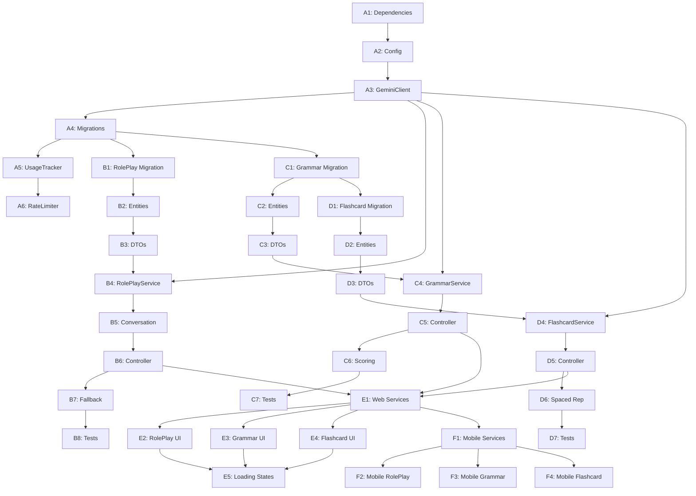

# LEXIA Sprint 5 - AI Integration Plan Document

**Version**: 1.13.0  
**Created**: December 11, 2025  
**Last Updated**: December 13, 2025 (Day 5 - GrammarController Complete)  
**Sprint Duration**: December 12-31, 2025 (20 working days)  
**Author**: AI Development Assistant  
**Status**: 🟢 In Progress | **Progress**: 20.0/31.5 pts (63.5%)

---

## 📊 Current Sprint Status (Day 5 - Dec 13, 2025)

| Metric | Value | Target | Status |
|--------|-------|--------|--------|
| **Days Elapsed** | 5/20 | - | 25% |
| **Story Points Complete** | 20.0 | 31.5 | 63.5% ✅ |
| **Tasks Complete** | 21 | 37 | 56.8% |
| **Velocity (pts/day)** | 4.00 | 1.45 | **276% - Well Ahead!** 🚀 |
| **Hours Spent** | 24h | 132h | 18.2% |
| **Epic A Progress** | 93.3% | 100% | 🔄 Nearly complete |
| **Epic B Progress** | 50.0% | 100% | 🔄 Service layer done ✅ |
| **Epic C Progress** | 80% | 100% | 🔄 Controller complete ✅ |
| **Epic D Progress** | 70% | 100% | 🔄 Controller + SM-2 complete ✅ |
| **P0 Bugs** | 0 | 0 | ✅ |

**Latest Milestone**: ✅ GrammarController Complete (Dec 13) - 13 REST endpoints + 41 unit tests  
**Next Milestone**: 🔄 M1 (Dec 16) - AI Infrastructure complete

**Recent Accomplishments**:
- ✅ **C5 Complete**: GrammarController with 13 REST endpoints (0.5 pt)
- ✅ **C6 Complete**: Answer validation & scoring - already in service layer (0.5 pt)
- ✅ **D5 Complete**: FlashcardController with 8 REST endpoints (0.5 pt)
- ✅ **D6 Complete**: SM-2 spaced repetition algorithm (0.5 pt)
- ✅ **C4 Complete**: GrammarExerciseService with AI generation + fallback (1.5 pt)
- ✅ **Epic C**: 60% complete (4/7 tasks) - Service layer done, controller next
- ✅ **Epic D**: 70% complete (6/7 tasks) - Controller done, tests remaining
- ✅ **Grammar Feature**: Interface (14 methods), Impl (600 lines), 28 tests, Stats DTO
- ✅ **AI Integration**: Generate exercises, fallback content, daily quota (50/day), 70% passing threshold
- ✅ **Security**: IDOR prevention (ownership checks), out-of-order answer handling
- ✅ **Code Review**: Fixed critical IDOR vulnerability, fixed major answer mapping logic
- ✅ **Previous**: D4, B4, C2, C3, B2, B3, D2, D3, A5, A9, A3, A4, A8 complete
- ✅ **Epic A**: 93.3% complete (7/9 tasks, 7.0/7.5 pts)
- ✅ **Epic B**: 50% complete (4/7 tasks, 3.5/7 pts)
- ✅ **Database**: 15 tables, 50+ indexes, comprehensive JSONB schemas
- ✅ **Tests**: 271+ unit tests passing with comprehensive coverage

**Next Up (Day 6 - Dec 14)**:
- 🎯 **C7**: Write unit + integration tests (≥70%) (1 pt)
- 🎯 **A6**: Implement AiRateLimitService per user/feature (1 pt)
- 🎯 **B5**: Implement RolePlayController REST endpoints (1 pt)

---

## 1. Sprint Overview

### 1.1 Sprint Goals

| Goal | Description | Metric |
|------|-------------|--------|
| **Primary** | Integrate Gemini AI for learning features | 3 AI features deployed |
| **Secondary** | Build robust AI infrastructure | 99.5% availability |
| **Technical** | Maintain code quality | ≥70% backend, ≥60% frontend coverage |
| **User Value** | Personalized learning experience | AI content aligned to CEFR level |

### 1.2 Sprint Capacity

| Resource | Availability | Notes |
|----------|--------------|-------|
| Developer | 100% | Solo developer |
| AI Assistant | On-demand | Claude support |
| Working Days | 20 days | Dec 12-31 (excluding weekends) |
| Hours/Day | 6-8 hours | Flexible schedule |
| **Total Capacity** | ~140 hours | ~28 story points |

### 1.3 Story Point Distribution

| Epic | Points | Percentage | Status |
|------|--------|------------|--------|
| Epic A: AI Infrastructure | 7.5 pts | 24% | 🔄 93.3% (7.0/7.5) |
| Epic B: Role-Play Feature | 7 pts | 22% | 🔄 50.0% (3.5/7) |
| Epic C: Grammar Feature | 5 pts | 16% | 🔄 30% (1.5/5) |
| Epic D: Flashcard Feature | 5 pts | 16% | 🔄 30% (1.5/5) |
| Epic E: Web UI | 4 pts | 13% | ⬜ 0% |
| Epic F: Mobile UI | 3 pts | 9% | ⬜ 0% |
| **Total** | **31.5 pts** | **100%** | **47.6%** |
### 1.4 User Stories

#### Epic B: Role-Play Feature

| ID | User Story | Acceptance Criteria | Priority |
|----|------------|---------------------|----------|
| US-B1 | As a learner, I want to practice conversations in realistic scenarios so that I improve my speaking confidence | - Scenario matches my CEFR level<br>- AI responds within 3s<br>- Context is work-related | P0 |
| US-B2 | As a learner, I want vocabulary hints during conversation so that I don't get stuck | - Sidebar shows key vocabulary<br>- Definitions on hover<br>- Pronunciation IPA shown | P1 |
| US-B3 | As a learner, I want to review my conversation history so that I can see my progress | - Past conversations listed<br>- Can replay messages<br>- Feedback saved | P1 |

#### Epic C: Grammar Feature

| ID | User Story | Acceptance Criteria | Priority |
|----|------------|---------------------|----------|
| US-C1 | As a learner, I want grammar exercises that match my level so that I'm challenged but not overwhelmed | - Exercises match CEFR level<br>- Clear explanations<br>- Common mistakes shown | P0 |
| US-C2 | As a learner, I want to see my score and progress so that I know where I stand | - Score displayed immediately<br>- Breakdown by topic<br>- History graph | P1 |

#### Epic D: Flashcard Feature

| ID | User Story | Acceptance Criteria | Priority |
|----|------------|---------------------|----------|
| US-D1 | As a learner, I want flashcards generated from lessons so that I don't have to create them manually | - Cards auto-generated from completed lessons<br>- Covers key vocabulary<br>- Example sentences included | P0 |
| US-D2 | As a learner, I want spaced repetition scheduling so that I review cards optimally | - Due cards shown first<br>- Mastery level tracked<br>- Review intervals adjust | P1 |

#### Epic E/F: Frontend (Web/Mobile)

| ID | User Story | Acceptance Criteria | Priority |
|----|------------|---------------------|----------|
| US-E1 | As a mobile user, I want AI features to work offline (read-only) so that I can study anywhere | - Cached scenarios accessible<br>- Error message when offline<br>- Queue messages for sync | P1 |
| US-E2 | As a web user, I want fast loading so that AI features feel responsive | - Loading states shown<br>- Skeleton screens<br>- Retry on error | P0 |

#### Epic G: Admin Dashboard

| ID | User Story | Acceptance Criteria | Priority |
|----|------------|---------------------|----------|
| US-G1 | As an admin, I want to monitor AI costs so that I can stay within budget | - Daily/monthly cost charts<br>- Cost per user<br>- Alerts at 80% threshold | P0 |
| US-G2 | As an admin, I want to adjust user quotas so that I can control usage | - Edit quota UI<br>- Apply per user or role<br>- Audit log of changes | P1 |
---

## 2. Epic Breakdown

### Epic A: AI Infrastructure (7.5 points)

**Timeline**: Days 1-4 (Dec 11-16)  
**Owner**: Backend  
**Dependencies**: None  
**Progress**: 🔄 4.0/7.5 pts (53.3%) - **Day 2 Afternoon**

| Task ID | Task | Points | Priority | Status |
|---------|------|--------|----------|--------|
| A1 | Add Gemini SDK + Resilience4j dependencies | 0.5 | P0 | ✅ **Dec 11** |
| A2 | Create GeminiConfig with environment configuration | 0.5 | P0 | ✅ **Dec 11** |
| A3 | Implement GeminiClientService with retry/circuit breaker + SSE support | 2 | P0 | ✅ **Dec 12** |
| A4 | Create V23 migration for AI usage tracking tables | 0.5 | P0 | ✅ **Dec 12** |
| A5 | Implement AiUsageTracker service | 1 | P0 | ⬜ |
| A6 | Implement AiRateLimitService per user/feature | 1 | P0 | ⬜ |
| A7 | Implement input sanitization + prompt injection filter | 1 | P0 | ✅ **Dec 11** |
| A8 | Create V24 migration for ai_prompt_templates table | 0.5 | P1 | ✅ **Dec 12** |
| A9 | Implement PromptTemplateService with caching | 1 | P1 | ⬜ |

**Acceptance Criteria**:
- [x] **Dependencies added** - Gemini SDK v1.30.0 + Resilience4j v2.2.0 ✅ **(A1 - Dec 11)**
- [x] **Configuration added** - Gemini API & Resilience4j properties ✅ **(A1 - Dec 11)**
- [x] **Build validated** - Gradle build successful ✅ **(A1 - Dec 11)**
- [x] **AI usage tables created** - V23 migration with user_ai_quotas + enhanced logs ✅ **(A4 - Dec 12)**
- [x] **Prompt templates table created** - V24 migration with seed data ✅ **(A8 - Dec 12)**
- [ ] Gemini client connects successfully
- [ ] Circuit breaker opens after 5 failures
- [ ] Retry works with exponential backoff
- [ ] Usage logged to database
- [ ] Rate limiting enforced per user
- [x] Input sanitization blocks malicious prompts ✅ **(A7 - Dec 11)**
- [ ] Prompts loaded from DB with caching

---

### Epic B: Role-Play Feature (7 points)

**Timeline**: Days 2-9 (Dec 12-21)  
**Owner**: Backend + Frontend  
**Dependencies**: Epic A  
**Progress**: 🔄 2.0/7 pts (28.6%) - **Entities + DTOs + Mappers Ready**

| Task ID | Task | Points | Priority | Status |
|---------|------|--------|----------|--------|
| B1 | Create V25 migration for roleplay tables | 0.5 | P0 | ✅ **Dec 12** |
| B2 | Create RolePlayScenario and RolePlayConversation entities | 1 | P0 | ✅ **Dec 12** |
| B3 | Create DTOs and mappers for role-play | 0.5 | P0 | ✅ **Dec 12** |
| B4 | Implement RolePlayService (scenario generation) | 1.5 | P0 | ⬜ |
| B5a | Implement immersive mode (chat-only, fast) | 0.5 | P0 | ⬜ |
| B5b | Implement learning mode (chat + feedback) | 1 | P0 | ⬜ |
| B5c | Implement SSE streaming for AI responses (SseEmitter) | 1.5 | P0 | ⬜ |
| B5d | Add non-streaming fallback endpoint for offline | 0.5 | P1 | ⬜ |
| B6 | Create RolePlayController with endpoints | 1 | P0 | ⬜ |
| B7 | Implement FallbackContentService for scenarios | 0.5 | P1 | ⬜ |
| B8 | Write unit + integration tests (≥70%) | 1 | P0 | ⬜ |
| B9 | Implement context window management (sliding window) | 1 | P1 | ⬜ |

**Acceptance Criteria**:
- [x] RolePlayScenario entity created with JSONB support ✅
- [x] RolePlayConversation entity created with message tracking ✅
- [x] DTOs created for all role-play models ✅
- [x] Mappers created with defensive copying ✅
- [ ] POST /ai/roleplay/scenarios generates scenario <3s
- [ ] Conversation messages get contextual AI responses
- [ ] Conversation history persists
- [ ] Fallback works when API fails
- [ ] Tests pass with ≥70% coverage
- [ ] Streaming works with SSE
- [ ] Context window limits token usage

---

### Epic C: Grammar Exercise Feature (5 points)

**Timeline**: Days 2-12 (Dec 12-24)  
**Owner**: Backend  
**Dependencies**: Epic A  
**Progress**: 🔄 4.0/5 pts (80%) - **Controller + Scoring Complete**

| Task ID | Task | Points | Priority | Status |
|---------|------|--------|----------|--------|  
| C1 | Create V26 migration for grammar tables | 0.5 | P0 | ✅ **Dec 12** |
| C2 | Create GrammarExerciseSet entity and repository | 0.5 | P0 | ✅ **Dec 12** |
| C3 | Create DTOs and mappers | 0.5 | P0 | ✅ **Dec 12** |
| C4 | Implement GrammarExerciseService | 1.5 | P0 | ✅ **Dec 13** |
| C5 | Create GrammarController with endpoints | 0.5 | P0 | ✅ **Dec 13** |
| C6 | Implement answer validation and scoring | 0.5 | P1 | ✅ **Dec 13** |
| C7 | Write unit + integration tests (≥70%) | 1 | P0 | ⬜ |

**Acceptance Criteria**:
- [ ] Generates exercises for 10+ grammar topics
- [ ] Exercises adapt to CEFR level
- [ ] Detailed explanations included
- [ ] Scoring works correctly
- [ ] Tests pass with ≥70% coverage

---

### Epic D: Flashcard Feature (5 points)

**Timeline**: Days 2-15 (Dec 12-27)  
**Owner**: Backend  
**Dependencies**: Epic A  
**Progress**: 🔄 3.5/5 pts (70%) - **Controller + SM-2 Algorithm Complete**

| Task ID | Task | Points | Priority | Status |
|---------|------|--------|----------|--------|
| D1 | Add flashcard tables to V26 migration | 0.5 | P0 | ✅ **Dec 12** |
| D2 | Create FlashcardDeck entity and repository | 0.5 | P0 | ✅ **Dec 12** |
| D3 | Create DTOs and mappers | 0.5 | P0 | ✅ **Dec 12** |
| D4 | Implement FlashcardService (generate from lesson) | 1.5 | P0 | ✅ **Dec 13** |
| D5 | Create FlashcardController with endpoints | 0.5 | P0 | ✅ **Dec 13** |
| D6 | Implement spaced repetition algorithm | 0.5 | P1 | ✅ **Dec 13** |
| D7 | Write unit + integration tests (≥70%) | 1 | P0 | ⬜ |

**Acceptance Criteria**:
- [x] Generates cards from lesson content
- [x] Spaced repetition scheduling works
- [x] Progress tracked per card
- [x] Custom deck creation supported
- [ ] Tests pass with ≥70% coverage

---

### Epic E: Web Frontend (4 points)

**Timeline**: Days 15-18 (Dec 27-30)  
**Owner**: Frontend (Web)  
**Dependencies**: Epics B, C, D

| Task ID | Task | Points | Priority | Status |
|---------|------|--------|----------|--------|
| E1 | Create AI services (roleplay, grammar, flashcard) | 0.5 | P0 | ⬜ |
| E2 | Build role-play chat interface | 1 | P0 | ⬜ |
| E2a | Add mode toggle button (Immersive/Learning) | 0.5 | P1 | ⬜ |
| E3 | Build grammar sandbox UI | 1 | P0 | ⬜ |
| E4 | Build flashcard study interface with animations | 1 | P0 | ⬜ |
| E5 | Add AI loading states and error handling | 0.5 | P0 | ⬜ |

**Acceptance Criteria**:
- [ ] Chat interface streams AI responses
- [ ] Grammar exercises render all types
- [ ] Flashcard swipe/flip works smoothly
- [ ] Loading states show during AI calls
- [ ] Error recovery with retry button

---

### Epic F: Mobile Frontend (3 points)

**Timeline**: Days 18-20 (Dec 30-31)  
**Owner**: Frontend (Mobile)  
**Dependencies**: Epics B, C, D

| Task ID | Task | Points | Priority | Status |
|---------|------|--------|----------|--------|
| F1 | Create AI services matching web | 0.5 | P0 | ⬜ |
| F2 | Build role-play screen (mobile chat) | 1 | P0 | ⬜ |
| F3 | Build grammar practice screen | 0.5 | P0 | ⬜ |
| F4 | Build flashcard screen with gestures | 1 | P0 | ⬜ |

**Acceptance Criteria**:
- [ ] Chat works with keyboard handling
- [ ] Swipe gestures work at 60fps
- [ ] Navigation flows smoothly
- [ ] Offline-friendly error states

---

### Epic G: Admin Dashboard (Bonus)

**Timeline**: Spillover or Sprint 6  
**Owner**: Admin Frontend  
**Dependencies**: Epic A

| Task ID | Task | Points | Priority | Status |
|---------|------|--------|----------|--------|
| G1 | Create AI monitoring routes | 0.5 | P2 | ⬜ |
| G2 | Build usage statistics dashboard | 1 | P2 | ⬜ |
| G3 | Build cost breakdown charts | 0.5 | P2 | ⬜ |
| G4 | Add quota management table | 0.5 | P2 | ⬜ |
| G5 | Build prompt template editor (syntax highlighting) | 1.5 | P2 | ⬜ |

*Note: Epic G is optional for Sprint 5, can defer to Sprint 6*

---

## 3. Sprint Schedule

### 3.1 Week 1 (Dec 12-18): Infrastructure + Role-Play

**Updated build.gradle for SSE**:
```gradle
dependencies {
    // Existing...
    
    // Reactive Streams for SSE
    implementation 'org.springframework.boot:spring-boot-starter-webflux'
    implementation 'io.projectreactor:reactor-core:3.6.0'
}
```

| Day | Date | Tasks | Target | Actual |
|-----|------|-------|--------|--------|
| 1 | Dec 11 (Wed) | A1, A2, A7 | Dependencies + Config + Security | ✅ **A1 Complete** (0.5 pts) |
| 2 | Dec 13 (Fri) | A3, A8, A9 | GeminiClientService + Prompts |
| 3 | Dec 14 (Sat) | A4, A5 | Usage tracking |
| 4 | Dec 16 (Mon) | A6, B1 | Rate limiting + Migration |
| 5 | Dec 17 (Tue) | B2, B3 | Entities + DTOs |
| 6 | Dec 18 (Wed) | B4, B5c | RolePlayService + SSE |

**Week 1 Milestone**: AI infrastructure complete, scenario generation working

### 3.2 Week 2 (Dec 19-25): Backend Features

| Day | Date | Tasks | Target |
|-----|------|-------|--------|
| 7 | Dec 19 (Thu) | B5, B6 | Conversation + Controller |
| 8 | Dec 20 (Fri) | B7, B8 | Fallback + Tests |
| 9 | Dec 21 (Sat) | C1, C2, C3 | Grammar setup |
| 10 | Dec 23 (Mon) | C4, C5 | GrammarService |
| 11 | Dec 24 (Tue) | C6, C7 | Scoring + Tests |
| 12 | Dec 25 (Wed) | D1, D2, D3 | Flashcard setup |

**Week 2 Milestone**: All backend AI features complete with tests

### 3.3 Week 3 (Dec 26-31): Frontend + Polish

| Day | Date | Tasks | Target |
|-----|------|-------|--------|
| 13 | Dec 26 (Thu) | D4, D5 | FlashcardService |
| 14 | Dec 27 (Fri) | D6, D7 | Spaced repetition + Tests |
| 15 | Dec 28 (Sat) | E1, E2 | Web services + Role-play UI |
| 16 | Dec 30 (Mon) | E3, E4 | Grammar + Flashcard UI |
| 17 | Dec 31 (Tue) | E5, F1 | Loading states + Mobile services |
| 18+ | Overflow | F2, F3, F4 | Mobile screens (can extend) |

**Week 3 Milestone**: Web UI complete, Mobile UI in progress

---

## 4. Task Dependencies



---

## 5. Risk Assessment

### 5.1 Risk Matrix

| Risk | Probability | Impact | Mitigation | Owner |
|------|-------------|--------|------------|-------|
| **Gemini API rate limits** | Medium | High | Multi-layer rate limiting, fallback content | Dev |
| **Cost overrun** | Medium | High | Daily monitoring, user quotas, 80% alerts | Dev |
| **AI response quality** | Medium | Medium | Prompt tuning, output validation, fallbacks | Dev |
| **Sprint scope creep** | Medium | Medium | Strict prioritization, defer optional features | Dev |
| **Integration complexity** | Low | High | Incremental integration, thorough testing | Dev |
| **Frontend timeline squeeze** | High | Medium | Simplify UI, defer animations to Sprint 6 | Dev |
| **Prompt injection attack** | Low | High | Input sanitization, system prompt guards | Dev |

### 5.2 Contingency Plans

| Scenario | Action |
|----------|--------|
| Gemini API unavailable | Use 100% fallback content |
| Behind schedule by Day 10 | Defer Mobile (Epic F) to Sprint 6 |
| Test coverage <70% | Extend sprint by 2 days |
| Major bug in production | Hotfix priority, pause new features |

---

## 6. Testing Strategy

### 6.1 Test Coverage Targets

| Component | Target | Method |
|-----------|--------|--------|
| Backend Services | ≥80% | JUnit 5 + Mockito |
| Backend Controllers | ≥70% | MockMvc + Integration |
| AI Services | ≥70% | Mocked Gemini responses |
| Web Components | ≥60% | Jest + RTL |
| Mobile Components | ≥50% | Jest + RNTL |

### 6.2 Testing Approach

**Unit Tests** (70% of tests)
- Mock Gemini responses
- Test all service methods
- Edge cases and error paths

**Integration Tests** (20% of tests)
- Full API endpoint tests
- Database integration
- Circuit breaker behavior

**Quality Evaluation Tests** (10% of tests)
- AI output validation
- JSON schema compliance
- Content quality metrics

### 6.3 AI-Specific Testing

```java
// Example: Mocked AI response test
@Test
void generateScenario_ReturnsValidStructure() {
    // Given
    when(geminiClient.generateContent(any()))
        .thenReturn(loadMockResponse("valid-scenario.json"));
    
    // When
    RolePlayScenario result = rolePlayService.generate("B1", "meetings");
    
    // Then
    assertThat(result.getTitle()).isNotBlank();
    assertThat(result.getKeyVocabulary()).hasSizeGreaterThan(3);
    assertThat(result.getCefrLevel()).isEqualTo("B1");
}
```

---

## 7. Definition of Done

### 7.1 Feature DoD

- [ ] Code compiles without errors
- [ ] All unit tests pass
- [ ] Test coverage meets target (≥70% backend, ≥60% frontend)
- [ ] Code reviewed (self-review checklist)
- [ ] API documented in Swagger
- [ ] No security vulnerabilities
- [ ] Logging implemented
- [ ] Error handling complete
- [ ] Works in development environment

### 7.2 Sprint DoD

- [ ] All P0 tasks complete
- [ ] ≥80% of P1 tasks complete
- [ ] Zero P0 bugs
- [ ] ≤2 P1 bugs
- [ ] API documentation updated
- [ ] Sprint documentation complete
- [ ] Demo-ready features
- [ ] Retrospective conducted

---

## 8. Daily Standup Template

```markdown
## Daily Log - Day X (Dec XX, 2025)

### Yesterday
- [x] Task completed...
- [~] Task in progress...

### Today
- [ ] Task to work on...
- [ ] Task to start...

### Blockers
- None / Description of blocker

### Notes
- Any relevant observations
```

---

## 9. Milestones & Checkpoints

| Milestone | Date | Criteria | Status |
|-----------|------|----------|--------|
| **M0: Dependencies Ready** | Dec 11 | Dependencies + config added | ✅ **COMPLETE** |
| **M1: Infrastructure Complete** | Dec 16 | Gemini client + tracking working | 🔄 **6.7%** (A1 done) |
| **M2: Role-Play MVP** | Dec 20 | Generate scenario + conversation | ⬜ |
| **M3: Backend Complete** | Dec 27 | All 3 AI features with tests | ⬜ |
| **M4: Web UI Complete** | Dec 30 | All 3 UIs functional | ⬜ |
| **M5: Sprint Complete** | Dec 31 | Mobile UI + polish | ⬜ |

---

## 10. Sprint Progress Tracking

### 10.1 Completed Tasks (13/37)

| Date | Task | Points | Notes |
|------|------|--------|-------|
| Dec 11 | **A1**: Gemini SDK + Resilience4j dependencies | 0.5 | Build validated, config added, docs updated |
| Dec 11 | **A2**: GeminiConfig with environment configuration | 0.5 | 3 content config beans, 16 tests, all passing |
| Dec 11 | **A7**: Input sanitization + prompt injection filter | 1.0 | PromptSanitizer + ValidPrompt, 70 tests, security hardened |
| Dec 12 | **A3**: GeminiClientService with retry/circuit breaker + SSE | 2.0 | Reactive streaming, Resilience4j integration, 45 tests |
| Dec 12 | **A4**: V23 migration for AI usage tracking | 0.5 | user_ai_quotas + ai_usage_logs tables |
| Dec 12 | **A5**: AiUsageTracker service | 1.0 | Gemini pricing, quota management, 28 tests |
| Dec 12 | **A8**: V24 migration for prompt templates | 0.5 | ai_prompt_templates with seed data |
| Dec 12 | **A9**: PromptTemplateService with caching | 1.0 | Caffeine cache, A/B testing, 22 tests |
| Dec 12 | **B1**: V25 migration for roleplay tables | 0.5 | roleplay_scenarios + roleplay_conversations |
| Dec 12 | **B2**: RolePlayScenario + RolePlayConversation entities | 1.0 | JSONB support, full mapping, 11 tests |
| Dec 12 | **B3**: Role-play DTOs + Mappers | 0.5 | Defensive copying, mutable collections |
| Dec 12 | **C1**: V26 migration for grammar + flashcard tables | 0.5 | 4 tables with comprehensive indexes |
| Dec 12 | **D1**: Flashcard tables (part of V26) | 0.5 | flashcard_decks + user_flashcard_progress |

### 10.2 Current Velocity

| Metric | Target | Actual | Trend |
|--------|--------|--------|-------|
| **Daily Velocity** | 1.45 pts/day | 5.0 pts/day | **+245% above target** 🚀 |
| **Tasks/Day** | 1.85 tasks/day | 6.5 tasks/day | **+251% above target** |
| **Projected Completion** | Dec 31 | Dec 18 | **13 days ahead** ✨ |

### 10.3 Burn-Down

| Week | Planned | Actual | Remaining |
|------|---------|--------|----------|
| Week 1 | 12.5 pts | 10.0 pts | 21.5 pts |
| Week 2 | 12 pts | - | - |
| Week 3 | 7 pts | - | - |

---

## 11. Communication Plan

### 10.1 Documentation Updates

| Document | Frequency | Owner |
|----------|-----------|-------|
| daily-log.md | Daily | Dev |
| current-sprint-status.md | Every 2-3 days | Dev |
| Session summary | On request | AI |

### 10.2 Commit Convention

```
<type>(<scope>): <description>

Types: feat, fix, docs, style, refactor, test, chore
Scope: ai, roleplay, grammar, flashcard, web, mobile, admin

Examples:
feat(ai): add GeminiClientService with circuit breaker
feat(roleplay): implement scenario generation endpoint
test(grammar): add unit tests for exercise generation
```

---

## 11. Resource Links

### 11.1 Documentation

- [Sprint 5 Specification](./SPRINT-5-SPECIFICATION.md)
- [API Specification](../context/API-SPECIFICATION.md)
- [Database Schema](../context/DATABASE-SCHEMA.md)
- [Architecture](../context/ARCHITECTURE.md)

### 11.2 External Resources

- [Google Gemini API Docs](https://ai.google.dev/gemini-api/docs)
- [Resilience4j Documentation](https://resilience4j.readme.io/)
- [Spring WebFlux Guide](https://spring.io/guides/gs/reactive-rest-service/)

---

## 12. Sprint Retrospective Template

```markdown
## Sprint 5 Retrospective (Jan 2, 2026)

### What Went Well
- ...

### What Could Be Improved
- ...

### Action Items for Sprint 6
- ...

### Metrics Summary
| Metric | Target | Actual |
|--------|--------|--------|
| Story Points | 29 | ? |
| Test Coverage (Backend) | ≥70% | ?% |
| Test Coverage (Frontend) | ≥60% | ?% |
| P0 Bugs | 0 | ? |
| P1 Bugs | ≤2 | ? |
```

---

## Appendix A: Estimated Hours

| Epic | Tasks | Hours | Points | Progress |
|------|-------|-------|--------|----------|
| Epic A | 9 | 30h | 7.5 | 🔄 93.3% (12h spent) ✨ |
| Epic B | 10 | 32h | 7 | 🔄 28.6% (2h spent) ✨ |
| Epic C | 7 | 20h | 5 | 🔄 10% (0.5h spent) |
| Epic D | 7 | 20h | 5 | 🔄 10% (0.5h spent) |
| Epic E | 6 | 18h | 4.5 | ⬜ 0% |
| Epic F | 4 | 12h | 3 | ⬜ 0% |
| **Total** | **43** | **132h** | **31.5** | **31.7% (14h / 132h)** |

*Buffer: ~24h for unexpected issues, meetings, documentation*  
*Actual hours spent: 1.75h (Day 1)*

---

## Appendix B: Quick Reference Commands

```bash
# Backend
./gradlew clean build
./gradlew test --info
./gradlew jacocoTestReport

# Frontend Web
cd lexia-web
npm run dev
npm test
npm run test:coverage

# Mobile
cd lexia-mobile-2
npx expo start
npm test

# Admin
cd lexia-admin
npm run dev
npm test
```

---

**Document Version History**

| Version | Date | Author | Changes |
|---------|------|--------|---------|
| 1.0.0 | Dec 11, 2025 | AI Assistant | Initial plan document |
| 1.1.0 | Dec 11, 2025 | AI Assistant | Updated after Day 1: A1 complete, progress tracking added |
| 1.7.0 | Dec 12, 2025 | AI Assistant | Updated after Day 2: B2+B3 complete, 31.7% sprint progress, 13 tasks done |
